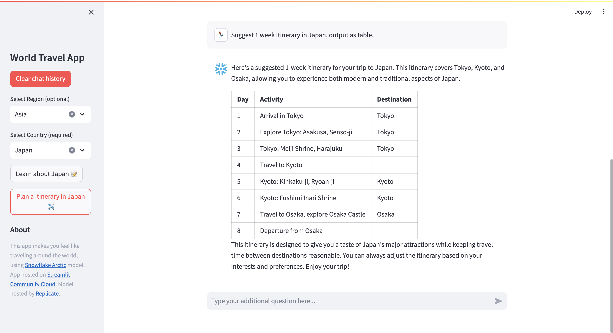

# World Travel App
App URL: https://world-travel.streamlit.app/



This app makes you feel like traveling around the world, using [Snowflake Arctic](https://www.snowflake.com/blog/arctic-open-and-efficient-foundation-language-models-snowflake) model.

## What can this app do?
1. It tells you about the features of countries all over the world.
2. It suggests 1 week itinerary for that country.
3. It answers anything else you ask.

### Select country
You can select `Region` and `Country` from the side bar.  
If you choose `Region`, you can select `Country` in that region.  
If you don't choose `Region`, you can select `Country` from all.

### Press button
After you select `Country`, you will be able to use 2 buttons.
1. `Learn about Country` button  
   App tells you about the features of that country.
2. `Plan a itinerary` button  
   App suggests 1 week itinerary in that country as table.

Also you can use `Clear chat history` button.  
Unless you push the clear button, the chat history will be saved, allowing you to ask additional questions from the text field.

# (For developer) How to build this app

## Getting your own Replicate API token

To use this app, you'll need to get your own [Replicate](https://replicate.com/) API token.

After creating a Replicate account, you can access your API token from [this page](https://replicate.com/account/api-tokens).

## Setup Instructions

### Prerequisites
- Python 3.8 or later 🐍
- pip3 📦

### Installation
1. **Clone this repository**
   ```bash
   git clone https://github.com/DS-MF/snowflake-arctic-st-app.git
   cd snowflake-arctic-chatbot
   ```

2. **Install requirements**
   ```bash
      pip install -r requirements.txt
   ```

3. **Add your API token to your secrets file**\
Create a `.streamlit` folder with a `secrets.toml` file inside.
   ```bash
   mkdir .streamlit
   cd .streamlit
   touch secrets.toml
   ```
   
   Use your text editor or IDE of choice to add the following to `secrets.toml`:
      ```toml
      REPLICATE_API_TOKEN = "your API token here"
      ```
   Learn more about Streamlit secrets management in [our docs](https://docs.streamlit.io/deploy/streamlit-community-cloud/deploy-your-app/secrets-management).
   
   Alternatively, you can enter your Replicate API token via the `st.text_input` widget in the app itself (once you're running the app).

4. **Run the Streamlit app**
To run this app, enter:
   ```bash
   cd ..
   streamlit run travel_app.py
   ```

### Deployment
Host your app for free on Streamlit Community Cloud. These instructions are also available in [our docs](https://docs.streamlit.io/deploy/streamlit-community-cloud/deploy-your-app).

1. Sign up for a Community Cloud account or log in at [share.streamlit.io](https://share.streamlit.io/).
2. Click "New app" from the upper-right corner of your workspace.
3. Fill in your repo, branch, and file path. As a shortcut, you can also click "Paste GitHub URL" to paste a link directly to `streamlit_app.py` on GitHub.  

#### Optional: store your Replicate API token with Community Cloud secrets
Securely store your Replicate API token with Community Cloud's secrets management feature. These instructions are also available in [our docs](https://docs.streamlit.io/deploy/streamlit-community-cloud/deploy-your-app/secrets-management).
   
##### Add secrets before deploying
1. Before clicking "Deploy", click "Advanced settings..."  
2. A modal will appear with an input box for your secrets.   
3. Provide your secrets in the "Secrets" field using TOML format. For example:
   ```toml
   REPLICATE_API_TOKEN = "your API token here"
   ```
   
##### Add secrets after deploying
1. Go to [share.streamlit.io](https://share.streamlit.io/).
2. Click the overflow menu icon (AKA hamburger icon) for your app.
3. Click "Settings".  
4. A modal will appear. Click "Secrets" on the left.  
5. After you edit your secrets, click "Save". It might take a minute for the update to be propagated to your app, but the new values will be reflected when the app re-runs.
